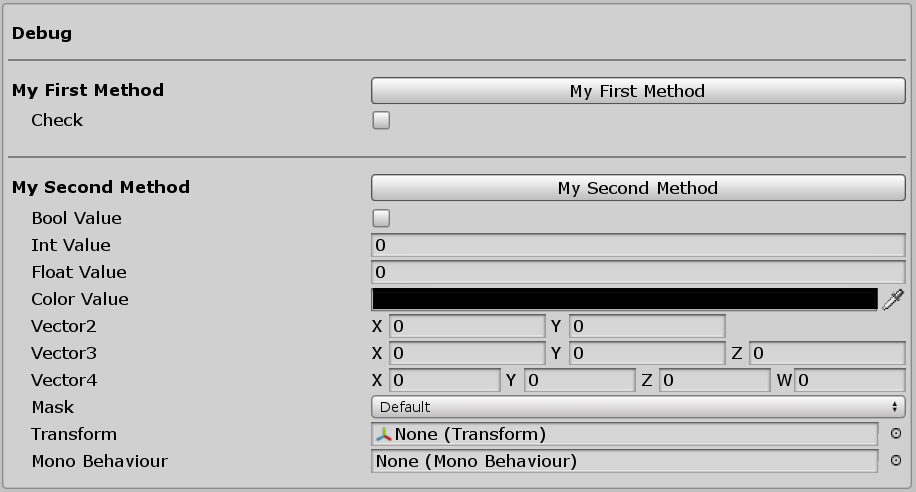

# [DebugButton] Attribute

<p align="center">

</p>

Creates a button in the inspector to call a method inside the Unity Editor. Only support a limited number of parameter object types.

```csharp
[DebugButton]
public void MyMethod()
{
    Debug.Log("Hello, world!");
}
```

Special thanks to Bjørn Jespersen-Kaae for creating the original script :)
