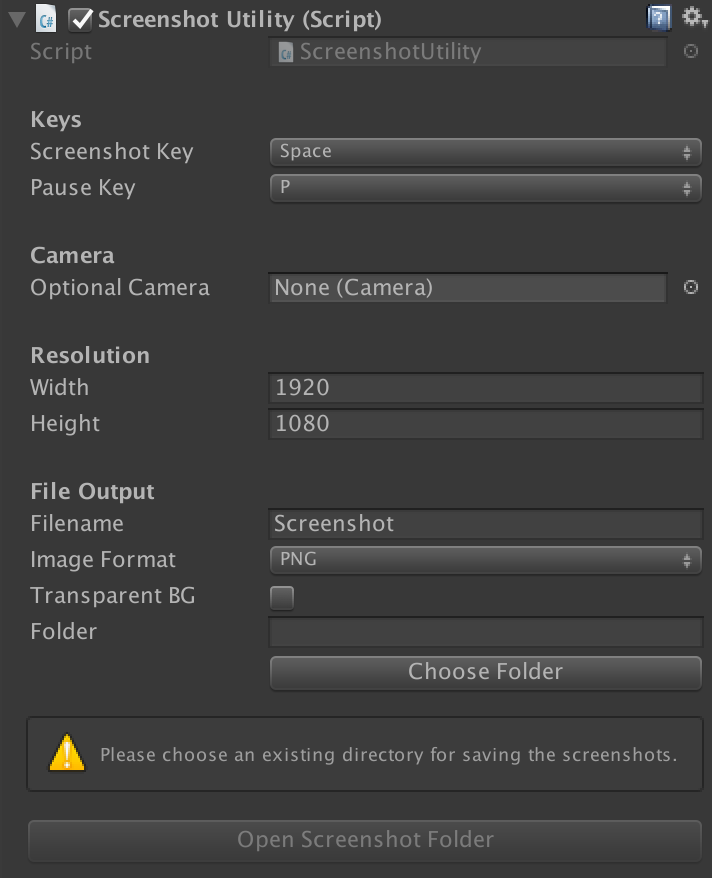

# Screenshot Utility
Simple tool for taking screenshots with any camera inside the editor. It allows you to set a custom resolution and outputs to PNG, JPEG or EXR.

_**Note:** I have not tested this when using multiple cameras to composite the final image, and I don't expect it to work. I may add this in the future._

