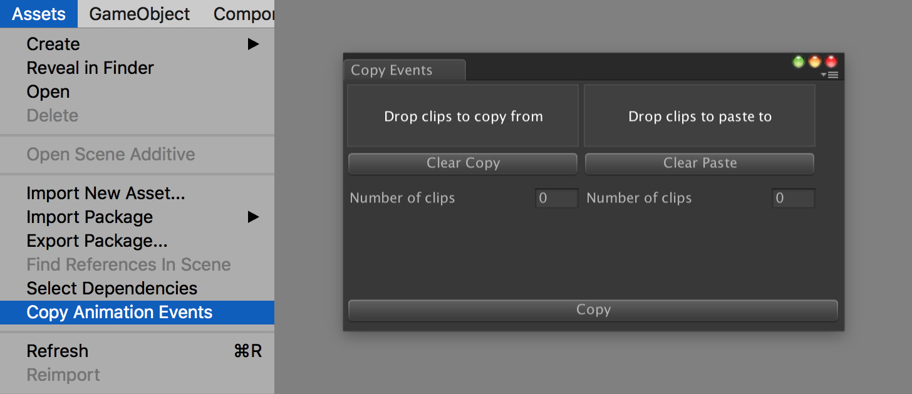

# Copy Animation Events

Editor script to copy animation events from one clip to another. 

The script also works for imported models (like FBX files). 

**Important;** When using on models the target clip is matched by name. This means that if you have two animation clips with the same name on the same model, both will get the events assigned.

Open the tool by going to **Assets > Copy Animation Events** in the menu.

